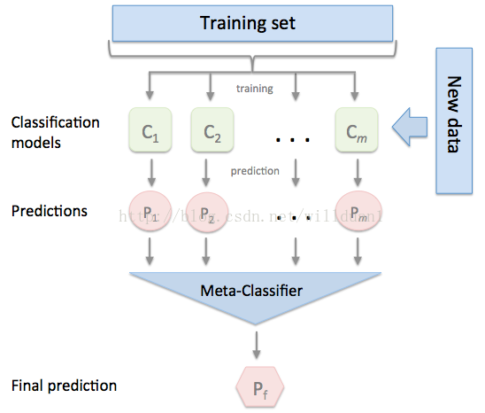

**Bootstrap**

称为自助法，它是一种有放回的抽样方法，它是非参数统计中一种重要的估计统计量方差而进行区间估计的统计方法。核心思想和基本步骤如下

- 采用重采样技术从原始样本中抽取一定量（自己设定采样个数）的样本，此过程允许重复抽样。
- 根据抽出的样本计算统计量T。
- 重复上述N次，得到统计量T。
- 计算上述N个统计量T的样本方差，得到统计量的方差。

**Bagging(bootstrap aggregating)**

- 从原始样本中抽取训练集。每轮从原始样本集中使用Bootstraping的方法抽取n个训练样本（这样的话，有些样本可能被多次抽到，而有些样本可能一次都没有被抽中）。共进行k轮抽取，得到k个训练集。（k个训练集之间是相互独立的）
- 每次使用一个训练集得到一个模型，k个训练集共得到k个模型。（注：这里并没有具体的分类算法或回归方法，我们可以根据具体问题采用不同的分类或回归方法，如决策树、感知器等）
- 对分类问题：将上步得到的k个模型采用投票的方式得到分类结果；对回归问题，计算上述模型的均值作为最后的结果。（所有模型的重要性相同）

**Boosting**

其主要思想是将弱分类器组装成一个强分类器。在PAC（概率近似正确）学习框架下，则一定可以将弱分类器组装成一个强分类器。关于Boosting的两个核心问题：

- 在每一轮中如何改变训练数据的权值或概率分布？

通过提高那些在前一轮被弱分类器分错样例的权值，减少上一轮正确分类的样本权重，来使得分类器对误分的数据有较好的效果

- 通过什么方式来组合弱分类器？

通过加法模型将分类器进行线性组合，比如Adaboost通过加权多数表决的方式，即增大错误率小的分类器的权值，同时减少错误率较大分类器嗯等权值，而提升树通过拟合残差的方式逐步减少残差，将每一步生成的模型叠加得到最终模型。

**区别**

- 样本选择上
  - Bagging：训练集是在原始集中有放回选取的，从原始集中选出的各轮训练集之间是独立的
  - Boosting：每一轮的训练集不变，只是训练集中每个样例在分类器中的权重发生变化，变化基于上一轮的分类结果进行调整。
- 样例权重
  - Bagging：采用均匀取样，每个样例的权重相等
  - Boosting：根据错误率不断调整样例的权值，错误率越大则权重越大
- 预测函数
  - Bagging：所有预测函数的权重相等
  - Boosting：每个弱分类器都有对应的权重，对于分类器误差小的分类器会有更大的权重。
- 并行计算
  - Bagging：可以并行
  - Boosting：各个预测函数只能顺序生成，因为后一个模型需要用到前一轮的模型结果。

Bagging + Decision Tree = Random Forest

AdaBoost + Decision Tree = 提升树

Gradient  Boosting + Decision Tree = GBDT

### 为什么说bagging是减少variance，而boosting是减少bias?

Bagging对样本重采样，对每个重采样得到的子样本集训练一个模型，最后取平均。由于子样本集的相似性以及使用的是同种模型，因此各模型有近似相等的bias和variance（事实上，各个模型分布也近似相同，但不独立）。由于$E[\frac{\sum X_i}{n}]=E[X_i]$, 所以bagging后的bias和单个子模型的接近，一般来说不能显著降低bias。另一方面，若各个模型独立，则有$var(\frac{\sum X_i}{n})=\frac{var(X_i)}{n}$，此时可以显著降低variance。若各个子模型完全相同，则$var(\frac{ \sum X_i}{n})=\frac{var(x_i)}{n}$，此时不会降低variance，若此时各个子模型完全相同，则$var(\frac{\sum X_i}{n})=var(x_i)$，此时不会降低variance。bagging方法得到的各子模型是有一定相关性的，属于上面两个极端状况的中间态，因此可以一定程度降低variance。为了进一步降低variance，Random forest通过随机选取变量子集做拟合的方式de-correlated了各子模型（树），使得variance进一步降低。

设有$i.d.$的n个随机变量，方差记为$\sigma^2$，两两变量之间的相关性为$\phi$，则$\frac{X_i}{n}$的方差为$\phi \sigma^2 + (1-\phi)\sigma ^2 /n$，bagging降低的是第二项，random forest是同时降低两项。详见ESL p588公式15.1。

boosting从优化角度来看，是用forward-stagewise这种贪心法去最小化损失函数$L(y, \sum_i a_if_i(x))$。如常见的AdaBoost即等价于用这种方式最小化exponential loss $L(y, f(x))=e^{-yf(x)}$。所谓forward-stagewise，就是在迭代的第n步，求解新的种子模型$f(x)$以及步长（或者组合系数），来最小化$L(y, f_{n-1}(x)+af(x))$，这里$f_{n-1}(x)$是前$n-1$步得到的子模型的和。因此boosting是在sequential地最小化损失函数，其bias自然逐步下降。但由于是采取这种sequential、adaptive的策略，各子模型之间是强相关的，于是子模型之和并不能显著降低variance。所以说boosting主要还是靠降低bias来提升预测精度。

- 准：bias描述的是根据样本拟合的模型的输出预测结果的期望与样本真实结果的差距，简单讲，就是在样本上拟合的好不好。
- 确：variance描述的是样本上训练的模型在测试集上的表现。

**stacking**

将训练好的所有基模型对整个训练集进行预测，第j个基模型对第i个训练样本的预测值将作为新的训练集中第i个样本的第j个特征值，最后基于新的训练集进行训练。同理，预测的过程也要先经过所有基模型的预测形成新的测试集，最后再对测试集进行预测：

