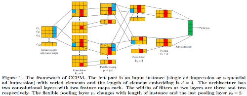
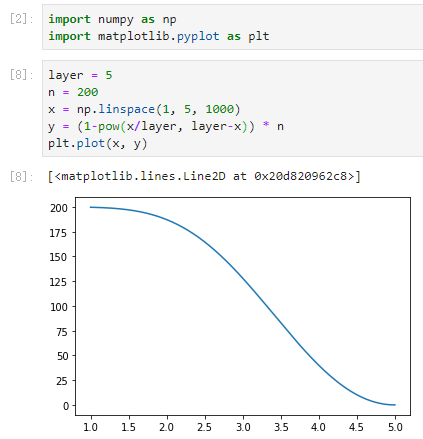
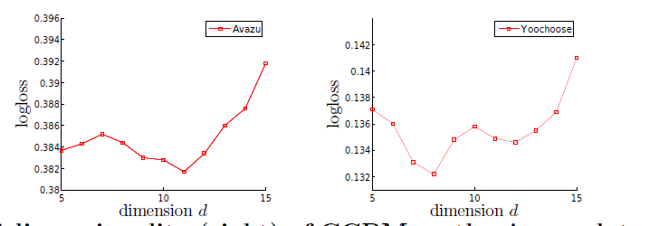
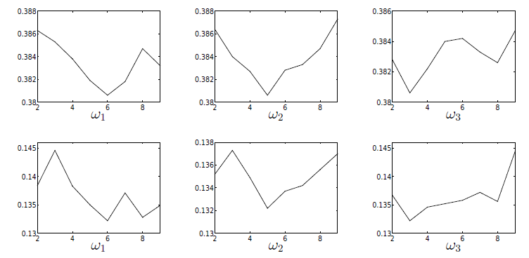
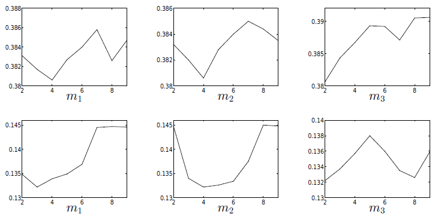

**CCPM(Convolutional Click Prediction)**



- 主要思想是通过一个$(width, 1)$的kernel(filter)对特征的embedding矩阵进行二维卷积，其中$width$表示的每对连续的$width$个特征进行卷积运算，之后使用一个**Flexible Pooling**机制进行池化操作进行聚合和压缩表示，堆叠若干层之后将得到的特征矩阵作为MLP的输入，最终得到预测结果。

  - 为何强调是连续的$width$个特征进行卷积?

  $$r_i=w_i^Ts_{i,j-w+1}:j$$ 其中索引$j\in[1,n+w-1]$，其中超出范围为的$s_{i,k}$设置为0.

  CNN有参数共享（通常一个特征检测子如边缘检测，在图像某一部位有用也在其他部位生效）和稀疏连接（每一层的输出只依赖于前一层小部分的输入）。虽然CTR中的CNN能够获得特征提取的功能，但是效果并不是很好，主要是由于特征本身不具有顺序性。直接利用连续值进行卷积，就产生一个默认的假设**连续的特征组合更具有意义**。虽然可以利用类似空洞卷积的思想来增加感受野使得卷积计算的时候跨越多个特征，但是这仍然具有随机性，所以使用CNN进行CTR任务时的特征提取的一个难点就是在与计算的是局部组合特征，无法捕获全局的组合特征。

  ```python
  class Conv2dSame(nn.Conv2d):
      """ Tensorflow like 'SAME' convolution wrapper for 2D convolutions
      """
  
      def __init__(self, in_channels, out_channels, kernel_size, stride=1,
                   padding=0, dilation=1, groups=1, bias=True):
          super(Conv2dSame, self).__init__(
              in_channels, out_channels, kernel_size, stride, 0, dilation,
              groups, bias)
          nn.init.xavier_uniform_(self.weight)
  
      def forward(self, x):
          ih, iw = x.size()[-2:]
          kh, kw = self.weight.size()[-2:]
          # 卷积结果wxh=(w-k_w+stride_w +2pad_w)/stride_w x (h-k_h+stride_h +2pad_h)/stride_h
          '''
          在这里需要通过padding一些value达到wxh。知道实际的输出为ohxow，若想让ohxow=hxw，则
          w-k_w+s_w+2p_w=w
          
          感受野和dilation的关系：感受野 r= (k-1)*dilation + 1
          
          集合感受野扩大的情况：卷积重新改写(仅考虑一个维度)
          w = (w_i - [(k-1)*d+1] + s + 2p) /s = w_o
          解出2p = sw_o - w_i + [(k-1)*d+1] - s = s(w_o-1) + (k-1) * d + 1 - w_i
          '''
          oh = math.ceil(ih / self.stride[0])  # 上取整
          ow = math.ceil(iw / self.stride[1])
          pad_h = max((oh - 1) * self.stride[0] + (kh - 1) * self.dilation[0] + 1 - ih, 0)
          pad_w = max((ow - 1) * self.stride[1] + (kw - 1) * self.dilation[1] + 1 - iw, 0)
          if pad_h > 0 or pad_w > 0:
              x = F.pad(x, [pad_w // 2, pad_w - pad_w // 2, pad_h // 2, pad_h - pad_h // 2])
          out = F.conv2d(x, self.weight, self.bias, self.stride,
                         self.padding, self.dilation, self.groups)
          return out
  ```

  

  - Flexible pooling?

  其实就是Max Pooling，只不过每次沿着某一维度取$p$个最大的，不是$1$个最大的。$p$的取值根据当前池化层数和总层数自适应计算。

  $$\begin{equation}
  p_i=
  \begin{cases}
  (1-(i/l)^{l-i})n& \text{i=1, ... ,l-1}\\
  3& \text{i=l}
  \end{cases}
  \end{equation}$$

  

  
  
  - 空洞卷积
    - **扩大感受野**：在deep net中为了增加感受野且降低计算量，总要进行降采样(pooling或s2/conv)，这样虽然可以增加感受野，但空间分辨率降低了。为了能不丢失分辨率，且仍然扩大感受野，可以使用空洞卷积。这在检测，分割任务中十分有用。一方面感受野大了可以检测分割大目标，另一方面分辨率高了可以精确定位目标。
    - **捕获多尺度上下文信息：**空洞卷积有一个参数可以设置dilation rate，具体含义就是在卷积核中填充dilation rate-1个0，因此，当设置不同dilation rate时，感受野就会不一样，也即获取了多尺度信息。**多尺度信息在视觉任务中相当重要啊。**

```python
class KMaxPooling(nn.Module):
    """K Max pooling that selects the k biggest value along the specific axis.

      Input shape
        -  nD tensor with shape: ``(batch_size, ..., input_dim)``.

      Output shape
        - nD tensor with shape: ``(batch_size, ..., output_dim)``.

      Arguments
        - **k**: positive integer, number of top elements to look for along the ``axis`` dimension.

        - **axis**: positive integer, the dimension to look for elements.

     """

    def __init__(self, k, axis, device='cpu'):
        super(KMaxPooling, self).__init__()
        self.k = k
        self.axis = axis
        self.to(device)

    def forward(self, input):
        if self.axis < 0 or self.axis >= len(input.shape):
            raise ValueError("axis must be 0~%d,now is %d" %
                             (len(input.shape) - 1, self.axis))

        if self.k < 1 or self.k > input.shape[self.axis]:
            raise ValueError("k must be in 1 ~ %d,now k is %d" %
                             (input.shape[self.axis], self.k))

        out = torch.topk(input, k=self.k, dim=self.axis, sorted=True)[0]  # 取topk进行输出
        return out
```

- 其他

  - 激活函数tanh或者其他
  - 损失函数log 损失

  $$log \  loss = - \frac{1}{n_{test}}[\sum_{i=1}^{n_{test}} y_i log p_i + (1- y_i) log (1- p_i)]$$

  - 超参确定

    - 维度embedding d的确定

    

    由上可知，当$d \in [5，12]$是可以取得最好值，分别为$d=11$和$d=6$

    - 间隔$w$确定

    ​    

    ​		上下分别是在两个不同的数据集上进行的结果（上Avazu data，下Yoochoose），$w_i$表示第$i$层

    - 卷积核个数确定

    

    借助公式$F_j^i=\sum_{k=1}^{m_i}w_{j,k}^i * F_k^{i-1}$

    ``` python
    class ConvLayer(nn.Module):
        """Conv Layer used in CCPM.
    
          Input shape
                - A list of N 3D tensor with shape: ``(batch_size,1,filed_size,embedding_size)``.
          Output shape
                - A list of N 3D tensor with shape: ``(batch_size,last_filters,pooling_size,embedding_size)``.
          Arguments
                - **filed_size** : Positive integer, number of feature groups.
                - **conv_kernel_width**: list. list of positive integer or empty list,the width of filter in each conv layer.
                - **conv_filters**: list. list of positive integer or empty list,the number of filters in each conv layer.
          Reference:
                - Liu Q, Yu F, Wu S, et al. A convolutional click prediction model[C]//Proceedings of the 24th ACM International on Conference on Information and Knowledge Management. ACM, 2015: 1743-1746.(http://ir.ia.ac.cn/bitstream/173211/12337/1/A%20Convolutional%20Click%20Prediction%20Model.pdf)
        """
    
        def __init__(self, field_size, conv_kernel_width, conv_filters, device='cpu'):
            super(ConvLayer, self).__init__()
            self.device = device
            module_list = []
            n = int(field_size)
            l = len(conv_filters)
            filed_shape = n
            for i in range(1, l + 1):
                if i == 1:
                    in_channels = 1
                else:
                    in_channels = conv_filters[i - 2]
                out_channels = conv_filters[i - 1]
                width = conv_kernel_width[i - 1]
                k = max(1, int((1 - pow(i / l, l - i)) * n)) if i < l else 3
                module_list.append(Conv2dSame(in_channels=in_channels, out_channels=out_channels, kernel_size=(width, 1),
                                              stride=1).to(self.device))
                module_list.append(torch.nn.Tanh().to(self.device))
    
                # KMaxPooling, extract top_k, returns tensors values
                module_list.append(KMaxPooling(k=min(k, filed_shape), axis=2, device=self.device).to(self.device))
                filed_shape = min(k, filed_shape)
            self.conv_layer = nn.Sequential(*module_list)
            self.to(device)
            self.filed_shape = filed_shape
    
        def forward(self, inputs):
            return self.conv_layer(inputs)
    ```

    其中feature map的个数通过设定输入输出通道数进行确定。