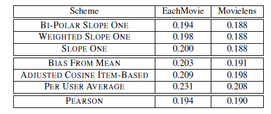

文章指出协同过滤（CF）机制包括如下特点：

- 易于实现和维护：数据本身易于解释，并且可以很容易测试和实现。
- 即时可更新：新的评分产生可以随时更改所有要预测的rating。
- 查询时效性：可以存在以存储为代价的查询。
- 用户冷启动问题：对于评分很少的用户也可以能给出有效的推荐。
- 准确无误：算法机制应先用最准确的方案，暗示Slope one的准确率高，并且简单。

其中slope one的目标是满足上边的五种特点。

在相关工作中提出，鉴于前人的基础，得出了基于$f(x)=ax+b$形式的预测模型可以与基于记忆的算法机制进行竞争。因此，slope one算法更加精简一步，使用$f(x)=x+b$预测模型进行预测，其中的slope one是指的$x$的系数$1$。

定义符号如下：

- $u$表示不完整的评分集合，当对于评分时，这个过程称为评估。
- $u_i$表示用户给出物品$i$的评分。
- $S(u)$被用户$u$的评过分的所有item的集合。
- $X$表示训练集中所有评估的集合。
- $card(S)$表示集合$S$中的元素个数是$card(S)$。
- $\bar{u}$用户$u$的所有评过分的均值。
- $S_i(X)$是所有评估过$u \in X$中包含物品$i(i\in S(u))$组成的集合。
- $P(u)$表示预测的结果，表示每个分量都是对应一个物品的预测结果的向量，$P(u)$隐含地依赖于训练集$X$。
- 标量乘积，给定两个评估$u$和$v$，我们定义标量乘积$<u,v>=\sum_{i \in S(u) \cap S(v)} u_i v_i$。

其中解决问题的基本思路是对每个用户$u$所对应的item $i$进行分别预测，涉及用户和item两个输入。

***方案1（Baseline）***

$$P(u)_i = \bar{u} + \frac{1}{card(S_i(X))}\sum_{v \in S_i(X)} v_i - \bar{v}$$

这个预测基于用户的rating平均分再加上训练集$X$中的所有用户对该物品$i$的评分与评分平均值的平均偏差。

基于前人工作，进一步利用余弦相似度（consine）调整度量，即

$$sim_{i,j}=\frac{\sum_{u \in S_{i,j}(X)}(u_i - \bar{u})}{\sum_{u \in S_{i,j}(X)}(u_i - \bar{u})^2 \sum_{u \in S_{i,j}(X)}(u_j - \bar{u})^2} $$

最终的预测是由这些度量加权求和得到的：

$$P(u)_i = \frac{\sum_{j \in S(u)}|sim_{i,j}|(a_{i,j}\mu_j + \beta_{i,j})}{\sum_{j \in S(u)}|sim_{i,j}|}$$

其中回归系数$\alpha_{i,j}$、$\beta_{i,j}$是由在$i$和$j$固定的条件下的最小化$\sum_{u\in S_{i,j}(u)}(a_{i,j}\mu_{j}\beta_{i,j}-\mu_i)^2$

**方案1的进阶工作是为了和之前的基于Item的算法工作进行的对比**。

***方案2（参考Pearson）***

提出此方案主要是为了和基于memory方案的一个对比，此文中指出基础的方案是pearson方案。

$$P(u)_i = \bar{u} + \frac{ \sum_{v \in S_i(X)} \gamma(u,v)(v_i, \bar{v})}{\sum_{v \in S_i(X)}|\gamma(u,v)|}$$

其中$\gamma$表示皮尔逊计算出来的相似性度量：

$$Corr(u,w)=\frac{<u-\bar{u}, w-\bar{w}>}{\sqrt{\sum_{i \in S(u) \cap S(w)}(u_i - \bar{u})^2\sum_{i \in S(u)\cap S(w)}(w_i - \bar(w))^2}}$$

进一步的引入加权pearson系数，

$\gamma(u,w)=|Corr(u,w)|^{\rho} \frac{Corr(u,w)}{|Corr(u,w)|}$

其中$\rho=0.25$默认，表示样本权重。此值降低了数据中的噪声：如果相关性特别高0.9，经过运算依然可以保持很高的相关性（0.8），当相关性很低的时候如$0.1$，此时变化为$0.003$会导致权重变得很小，主要目的是降低若相关性对算法的影响。

***方案3 （Slope one）***

与上边算法不同是的是**slope one**不仅考虑了评分过的当前物品的其他用户信息，同时还考虑了当前用户评过分的其他物品信息。

给定两个评分集合$v_i$和$w_i$，其中$i=1,\cdots, n$，通过最好的预测器$f(x)=x+b$来预测$w$基于$v$的最小化$\sum_i(v_i+b-w_i)^2$。对最小化函数进行求导可知$b=\frac{\sum_i w_i - v_i}{n}$。常数$b$需要取集合差值的平均值。

给定训练集$X$，以及item$i$和$j$以及用户对其的评分$u_i$和$u_j$(其中$u \in S_{j,i}(X)$)，考虑物品之间的平均偏差矩阵为

$$dev_{j,i}=\sum_{u \in S_{i,j}(X)}\frac{u_j-u_i}{card(S_{i,j}(X))}$$

这样一来，当新物品来的时候，可以利用上式进行快速更新评分。

当固定$u_i$的时候，$dev_{j,i} + u_i$为$u_j$的预测值，为了消除偏差，可以使用均值作为预测值。

$$P(u)_j=\frac{1}{card{(R_j)}}\sum_{i \in R_j}(dev_{j,i}+u_i)$$

其中$R_j={i|i\in S(u), i \ne j, card(S_{i,j}(X)) > 0}$表示所有相关item的集合。基于大规模密集数据集的基础上，（即假设对任意一对Item都有评分依据，对于大多数item $i$和$j$的$card(S_{j,i}(X))>0$。）基于上边的假设，slope one 算法可以进一步改写为

$$P(u)_j=\bar{u} + \frac{1}{card(R_j)}\sum_{i \in R_j}dev_{j,i}$$

其中$\bar{u}=\sum_{i \in S(u)} \frac{u_i}{card(S(u))}$，其中

**由此可见若是稀疏矩阵此方式并不一定性能较好**

slope one 算法依赖于用户已经rating过的item和那些被当前用户rating的item。

***方案4 （加权slope one算法）***

$$P(u)_j = \frac{\sum_{i \in S(u) - {j}}(dev_{j,i} + u_j) c_{j,i}}{\sum_{i\in S(u) - {j}}c_{j,i}}$$

其中$c_{j,i}$为$card(S_{j, i}(X))$

***方案5 （方案4的一种实现）***

基于方案4的加权思想，引入like和dislike两个不同的集合，其中dislike和like是按照平均rating来断定的。即大于平均rating的为like，小于平均rating的为dislike。

其中偏差矩阵定义为

$$dev_{j,i}^{like}=\sum_{u \in S_{j,i}^{like}(X)}\frac{u_j - u_i}{card(S_{j,i}^{like}(X))}$$

预测函数为

$$p_{j,i}^{like}=dev_{j,i}^{like}+u_i$$

总的加权为

***评价指标***

其中$X^{\prime}$为要预测的rating集合。

***结果***

在两种数据集上，随着方案数的数的增加，在EachMoive数据集上获得结果依次提升，而在MovieLens数据集上后3种方式优化不明显。

***总结***

slope one算法实现以及理解上都是较为简单的，但是对于不同的数据集上其效果并一定总是如意的，由于预测器在处理上是建立在密集矩阵的情况下，这样的话总体偏差较小。

***Idea***

- 在EachMovie上，细分为like和dislike，可以借助lightgbm种hist算法，进一步划分，此时的划分按照区间进行划分，相比于文中给出的权重划分更加细粒度。
- 考虑恶意用户问题，即用户普遍打低分，与大众分数严重偏离，在这个基础上可以利用hist进行加权，这个加权值应该和hist的规模（所占比例相关）。