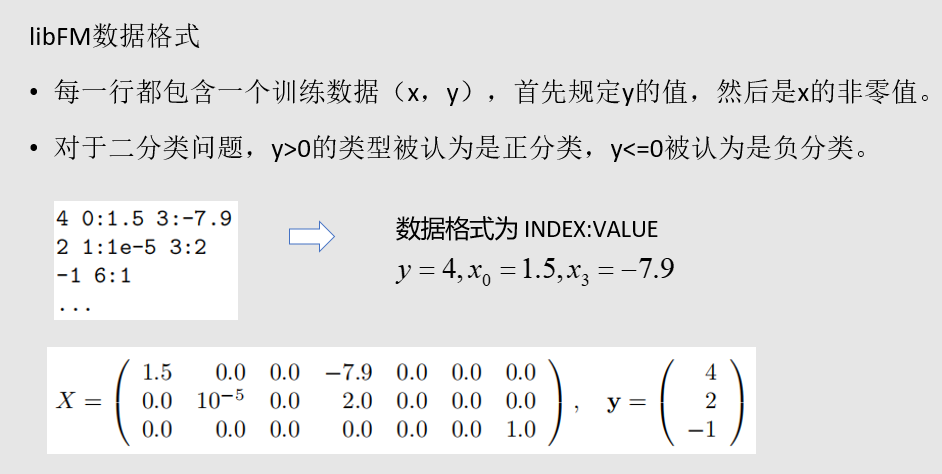
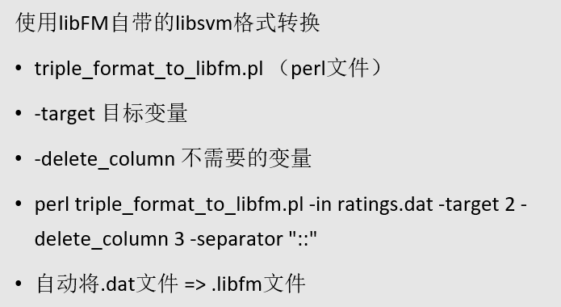
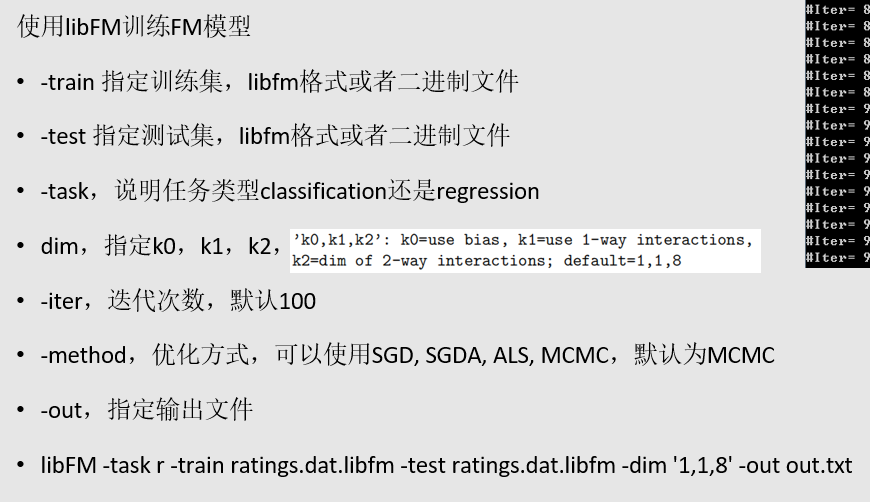
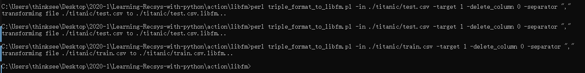
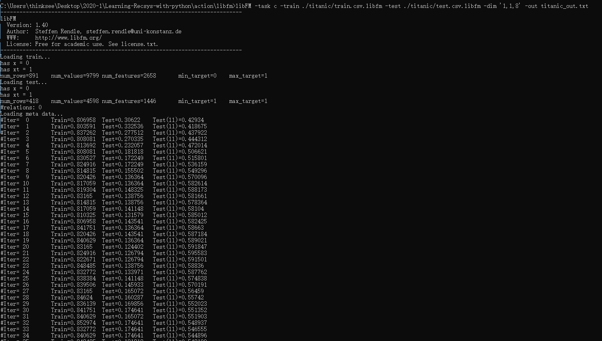
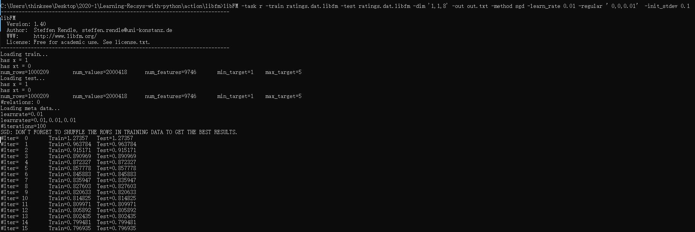

### LibFM数据格式

首行为target值，后边的值为对应的index-value，具体表示为feature和对应的value。

### Perl处理脚本的使用

需要安装perl解释器，可以参考https://www.runoob.com/perl/perl-environment.html

基本来源于https://github.com/srendle/libfm

### 使用libFM训练模型

### Tantic数据集简单处理

### movielens中rating数据简单处理

更加细节问题可以参考手册[link](http://www.libfm.org/libfm-1.42.manual.pdf)