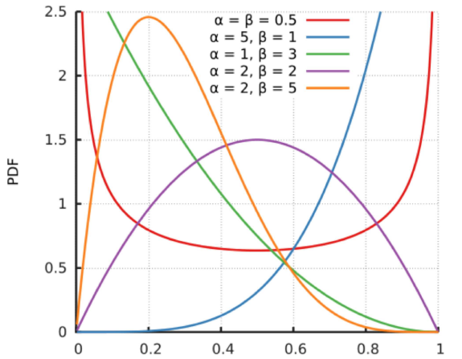
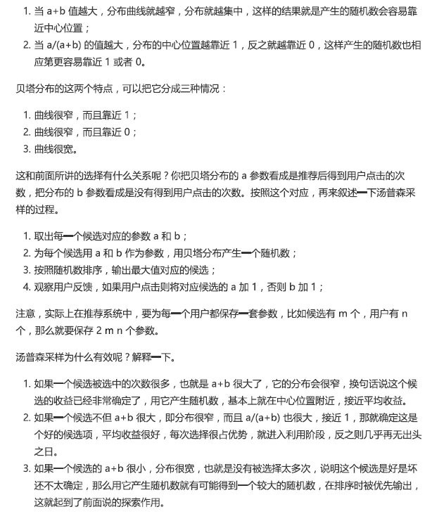

### **AI的定义**

人工智能（Artificial Intelligence），其是研究、开发用于模拟、延伸和扩展人的智能的理论、方法、技术及应用系统的一门新的技术科学。剑桥词典解释说“the study of how to produce machines that have some of the qualities that the human mind has, such as the ability to understand language, recognize pictures, solve problems, and learn”（研究如何生产具有人类智慧所拥有的一些特质的机器，如理解语言、识别图片、解决问题和学习的能力。），研究它的主要目标是使机器能够胜任一些通常需要人类智能才能完成的复杂工作。用陈老师的话来讲“Use data to slove problem”，但是在没有的数据的情况下AI是否存在呢，我觉得的也是存在的，如RL本身可以是不需要外部数据的，在生产过程中会依据算法本身产生数据，multi-agent的RL算法，agents的行为就可以建模为输入数据，这些数据并不是显性数据，但却是RL数据的源头之一。

### **机器学习的7个步骤**

可以分为：收集数据 -> 准备数据：数据预处理（特征工程） -> 选择模型 -> 训练 -> 评估 -> 超参调整 -> 预测。 在我看来主要分为两个重要的步骤，特征工程和模型调整。其中收集数据，可以利用爬虫（但是可能会涉及法律问题）、共享（同、不同行业之间）以及交易，这些与金钱和法律相关的东西可以暂且不考虑。特征工程：除了可以使用各种各样的结构（线性、非线性、树、图、循环、融合等等）来达到对特征以及组合特征的提取，还包括手工特征的创造，其是基于对数据的理解，并且模型的选的也是基于此。模型选择：模型的主要作用是去拟合所输入的数据，产生一个在此问题上较为通用的一个模型，提升其泛化的能力。其中处理的措施主要有两个单模型和多模型，多模型可以从两个维度考虑，串行或者并行。

### **模型参数和超参数的理解**

参数：模型可以学习的参数；超参数：需要人工干预的参数，可以利用随机搜索或者约束性搜索的方式找到局部的最优解。

### **线性回归和与逻辑回归**

[线性回归](https://www.kaggle.com/whs2018/general-machine-learning#Linear-models-with-Regularization)主要用来解决连续值预测的问题，逻辑回归用来解决分类问题，输出的属于某个类别的概率，工业界常常[用逻辑回](https://www.kaggle.com/whs2018/general-machine-learning#Logistic-Regression)归来做排序。在svm，gbdt，adaboost算法中都有涉及逻辑回归（损失函数，梯度下降，过拟合等）。

线性回归的损失函数一般定义为MSE（均方误差），使用[随机梯度下降]()算法进行优化学习，为了解决过拟合问题，引入了l1正则（lasso regression）和l2正则（ridge regression），还有就是对于样本减少特征数，对于树模型降低树的深度等。

逻辑回归利用的是sigmod函数，这个函数本身把样本的值映射到[0,1]之间，把原来的连续数值结果转化为概率结果。采用和线性回归同样的思路，鉴于逻辑回归的特殊性，其损失函数不能定义为MSE，损失函数的定义需要满足凹凸性，即存在最小值点（应用梯度下降算法）或者最大值点（应用梯度上升算法）。

从上可以获知，逻辑回归中，其中真实值的情况只是作为一个附带条件，其中损失的计算依赖于函数本身。

逻辑回归的优点有1）LR是以概率形式输出，不仅限于0和1；2）LR的可解释性强，可控性高；3）训练速度快；4）可以依照概率的形式做ranking model。其应用场景如CTR预估（gbdt + LR），电商搜索排序基线，电商购物搭配推荐；新闻app排序基线。

### **什么是推荐系统**

推荐系统是一种 信息过滤 系统，根据用户的历史行为、社交关系、兴趣点

### **推荐系统中的EE/冷启动问题**

在推荐的时候是”利用“还是“探索”，初次使用系统如何知道他的兴趣程度，关于选择性的问题都可以转化为MAB(multi-armed bandit problem, k-armed bandit problem, MAB)如

其中解决的方式可以采用Bandit算法，其思想就是，看看选择会带来多少遗憾，遗憾越少越好。在MAB问题里，用来量化选择好坏的指标就是累计遗憾，如下所示

Bandit算法中有几个关键元素：臂，回报和环境

**汤普森采样算法**，每个臂后面绑定一个概率分布（贝塔分布），每次做选择的时候，让每个臂的概率分布独立产生一个随机数，按照这个随机数排序，输出产生最大随机数的那个臂所对应的物品。

其中汤普森采样的过程以及原理（为啥是有效的如下所示）

**AlphaGo中的UCB算法**

**Epsilon贪婪算法**

每个臂都以1-Epsilon的概率选择收益最大的那个平均收益，其他随机选择（强化学习中常用）

冷启动问题的解决常规思路

### **推荐系统的3个模块：数据源、召回、排序**

**召回阶段**因为需要计算的候选集合太大，所以要想速度快，就只能上简单模型，使用少量特征，保证泛化能力，尽量让用户感兴趣的物品在这个阶段能够找回来；**排序阶段**核心目标是要精确，因为它处理的物品数据量小，所以可以采用经可能多的特征，使用比较复杂的模型，一且以精准为目标。

在召回阶段，使用(FM/FFM召回+多路召回)，其中排序模型可以使用（LR/FM/WDL/DeepFM）

### **原本的二分模型如何处理多分类问题**

**One-Vs-All**其思想是把一个多分类问题变成多个二分类的问题。选择其中一个类别为正类，使其他所有类别为负类。其中优点：普适性还比较广，可以用于能输出值或者概率的分类器，同时效率相对较好，有多个类别就训练多个分类器；缺点：很容易造成训练样本数量的不平衡，尤其在类别较多的情况下，经常容易出现正类样本的数量远远不及负类样本的数量，这样就会造成分类器的偏向性。

**One-Vs-One**相比于One-Vs-All由于样本数量可能的偏向性带来的不稳定性，One-Vs-One是一种相对稳健的扩展方法。对于同样的三分类器，让不同类别的数据两两训练分类器，可以得到3个二元分类器。任何一个测试样本都可以通过分类器的投票选举出预测结果。

对比One-Vs-One和One-Vs-All都可以得到三个分类器，但是若有k个不同的类别，对于One-Vs-All来说，一共需要训练k个分类器，而One-Vs-One则需要训练C(k,2)个分类器。

**Softmax**

Softmax函数使得所有概率之和为1，是对概率分布进行归一化。其中选用指数函数的理由有1）指数函数简单，并且是非线性的；2）该函数严格递增；3）这是一个凸函数。此时的代价函数

对该代价函数求最优解同样使用梯度下降的方式，其梯度公式如下所示

### 推荐系统的测试方法/评价指标

