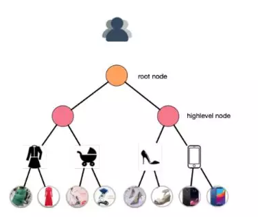
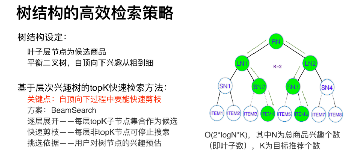
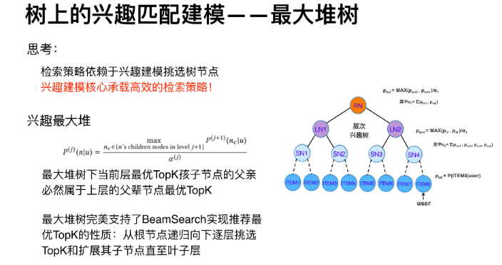
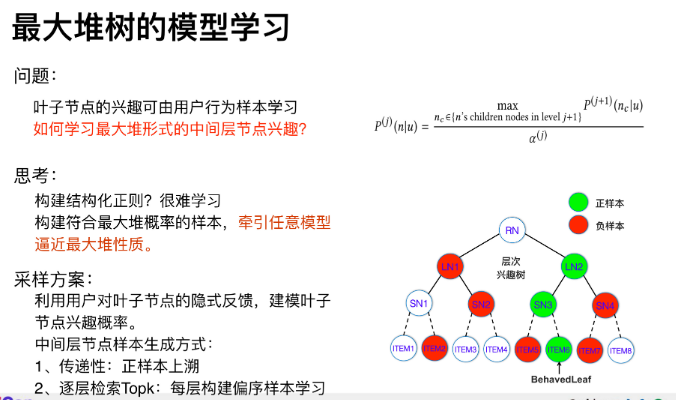

### Thinking

**1. 奇异值分解SVD的原理是怎样的，都有哪些应用场景**

SVD是矩阵分解的一种方式，SVD并不需要分解的矩阵为方阵，其基本原理是利用矩阵和自身转置进行相乘（这里可以计算出两个矩阵转置x原矩阵和原矩阵x转置）先转化为特征分解问题，然后求解出两个变换矩阵的特征向量，利用特征向量和原矩阵求出奇异值。

具体原理如下

把求解奇异值的过程转化为求解矩阵和其逆相乘的特征值平方根求解问题。

使用场景：1）将user-item评分问题，转化为SVD矩阵分解；2）降维，可以表现为两种方式，一种表征上的直接降维处理和PCA的作用类似（仅考虑奇异值）；3）另一种是利用分解的矩阵计算相似性（考虑U和V两个矩阵），利用U和V两个矩阵中的相关向量计算item和item以及user和user之间的关系。如在处理文本分类的时候（其中隐含因子为主题类别），其中大矩阵A，其每一行可以对应一篇文章，每一列对应一个词，当使用SVD的时候，矩阵U中的每个元素可以表示每篇文章和主题之间的相关性，中间矩阵可以表示为主题和关键词之间的相关性，矩阵V可以表示为关键词和每个文本词之间的相关性。

**2. funkSVD，BiasSVD，SVD++算法之间的区别是如何的**

- funkSVD避开了SVD所遇到的稀疏性问题（即矩阵中存在空值），并且使用两个矩阵相乘来近似评分矩阵，损失函数为近似矩阵和实际矩阵之差，把损失函数最小问题转化为最优化问题。
- BiasSVD在funkSVD的基础上，考虑了user和item本身的偏好，并且这个两个偏好值是算法学习的参数，不需要人工参与
- SVD++在BiasSVD的基础上考虑了隐式反馈（若没有评分，但可能有点击或者浏览等行为的产生），此时的隐式反馈相当于对商品偏好做了类似隐式ALS的置信度计算。更加具体的公式细节参考[05.md](05.md)

其中funkSVD，BiasSVD和SVD++算法都可以看成是对user/item的embedding。

**3. 矩阵分解算法在推荐系统中有哪些应用场景，存在哪些不足**

按照一般场景考虑，可以把推荐系统的评分计算例子进一步扩展，注意到只有当分解前后的矩阵是非负的，这样才可以被用来解释现实世界的物理量，这个分解称为非负矩阵分解（NMF, Lee et al. Learning the parts of objects by non-negative matrix factorization. *Nature* 401.6755 (1999): 788.）这样的话，应用场景可以进一步扩展如特征学习对人物脸部特征进行NMF，可以得到脸部的不同特征；图像分析，NMF可用作人脸识别，以及图像的处理分析；话题识别（把文本分类到不同的话题）；语音处理（利用NMF进行特征提取）；时序分割（NMF可以通过阈值设置把文件序列数据分割成不同兴趣主题）；聚类（和K-means等传统方式不同，每个数据都可以分为多种类型）等等。

不足：1）对于用户侧存在的丰富多样的特征，没有办法使用矩阵分解进行两两二阶交叉。2）使用矩阵分解主要体现还是在降维上，可以提高运算速度，但是有特征的损失。

**4. item流行度在推荐系统中有怎样的应用**

- 冷启动中使用
  - 用户冷启动，此时用户信息不足，但是考虑到推荐的item需要具有代表性，所以可以推荐具有较高覆盖率（推荐系统能够推荐出来的物品占总物品集合的比例）的item集合

- 协同过滤中的TopN推荐
- 对

**5. 推荐系统的召回阶段都有哪些策略**

- 多路召回，以内容、用户和设备等为线索权重融合召回
- FM做统一召回，计算每个特征和这个特征对应的训练好的embedding向量
- 早期采用“线性模型+人工特征组合引入非线性”进行召回
- 基于UserCF和ItemCF召回
- 深度树匹配召回【需要再次理解】

深度树匹配的核心是构造一棵兴趣树，其叶子节点是全量的物品，每一层代表一种细分的兴趣

在这里，假设已经得到深度树的情况下，高效检索采用的是Beam-Search的方式：

在已经得到深度树的情况下，一个新来的用户，我们怎么知道他对哪个分支的兴趣更大呢？我们首先需要将树建立为一棵最大堆树。

[link](https://myslide.cn/slides/10614#)