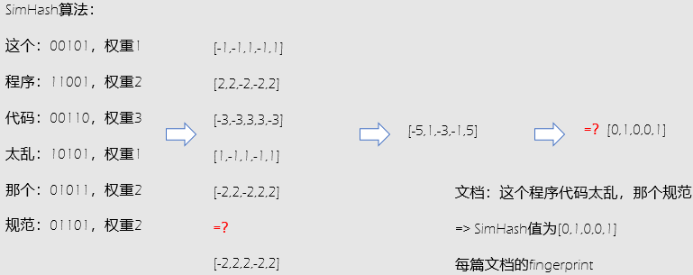

### Thinking

**1. 什么是近似最近邻查找，常用的方法有哪些**

Approximate Nearest Neighbor(ANN, 最近邻查找)，近似最近邻检索，在牺牲可接受范围内的精度的情况下提高检索效率。主要适用场景为海量数据且数据维度较高的情况下，利用近似降维，采用索引的方式进行查找。

- LSH (Locality-Sensitive Hashing, 局部敏感哈希)，它将相邻的数据，通过映射后依然保持相邻的关系，即保持局部的敏感性；

常用的方法包括MinHashLSH, MinHashLSHForest,  MinHashLSHEnsemble等算法。

**2. 为什么两个集合的minhash值相同的概率等于这两个集合的Jaccard相似度**

Jaccard的计算为两者之间交集除以两者之间的并集。

minhash采用“打垒”的方式，只考虑标记为1的索引。

minhash值相同是两者同时为1，即两者之间的交集，其中同时为0对计算没有意义，并且不会影响Jaccard的计算，若假定minhash的值相同的概率，即两者交集占所有情况的（除去0-0）比率相同，即Jaccard的相似度。

**3. SimHash在计算文档相似度的作用是怎样的？**

- 文档指纹计算过程

  - 设置SimHash的位数，比如32位，设置位数需要考虑存储成本以及数据集的大小
  - 初始化SimHash，将各位初始化为0
  - 使用N-gram方法提取文本中的特征
  - 使用传统的hash函数计算各个word的hashcode
  - 对各word的hashcode的每一位，若该位为1，则SimHash相应位的值加它的权重（通常是出现的频率）；否则减去它的权重
  - 计算最后得到的32位的SimHash，若该位大于1，则设为1；否则设为0

  
  
- 计算两个文档指纹的海明距离，通常2篇文档的Hamming距离在3以内，就认为相似度比较高

当文档数目比较大的时候，通过SimHash进行相似文档的检索，若直接计算，计算量太大，假设SimHash签名为64位，认为两个文档SimHash的Hamming距离在3以内就是相似的，通过抽屉原理，若距离阈值设置为k，则可以将SimHash分成K+1=4段，若此时至少有一段的SimHash是相同的，则表明结果相同，在此时采用的索引的方式进行查找加速，取出每一段相同的候选文本，借助候选文本来达到对候选结果的比较。

**4. 为什么YouTube采用期望观看时间作为评估指标**

CTR指标对于视频搜索具有一定的欺骗性，比如用户点击了一个视频，但是发现自己不喜欢，就马上关了，这样对于CTR预估来讲，会把其归结为一个正样本，这样会对用户个性化推荐产生误导，甚至降低用户的体验，降低客户忠诚度，所以youtube提出采用期望观看时间作为评估指标，划分样本空间时，正样本为点击，输出值为阅读时长值；负样本为无点击视频，输出值则统一采用1，即采用单位权值，不进行加权。与经典的CTR/Play Rate相比，采用每次曝光预期播放时间作为优化目标，可以提升模型效果。

**5. 为什么YouTube在排序阶段没有采用经典的LR（逻辑回归）当作输出层，而是采用了Weighted Logistic Regression？**

因为观看时长作为优化目标，为了刻画这个优化目标，主要是为了模拟观看时长不是只有0和1两种标签，所以YouTube采用了Weighted Logistic Regression来模拟这个输出。

