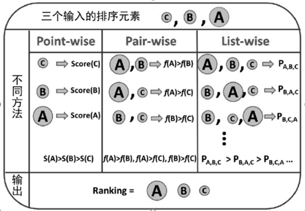

### Thinking

**1. 排序模型按照样本生成方法和损失函数的不同，可以划分成Pointwise, Pairwise, Listwise三类方法，这三类排序方法有何区别**

- Pointwise，针对单一文档，将每个文档为单独训练数据，算法简单，其缺点是从单文档分类角度计算，忽略了文档之间的相对顺序，无法对文档进行排序；

对于一个query，它将每个doc分别判断与这个query的相关程度，将docs排序问题转化为了分类问题（如相关、不相关）或回归问题（相关程度越大，回归函数的值越大）；从训练数据中学习到的分类或者回归函数对doc打分，打分结果即为搜索结果，CTR可以采用Pointwise方式进行学习，但是没有考虑排序列表中docs之间的关系。

- Pairwise，关注文档的顺序关系，需要对文档进行分类，得到文档集的偏序关系，只考虑每对文档之间的偏序关系，实际上，文档对并不是相互独立的，而且不同的查询拥有的文档对数目不同，结果会向拥有文档对较多的查询偏移。

Pairwise将排序问题转化为二元分类问题，当接收到用户查询之后，确定文档的先后顺序关系，对于统一查询的相关文档集中，对于任何两个不同label的文档可以得到一个有序的训练实例（x,y），若x>y此时标签即为+1，否则-1，这样讲的话，若排在前面的文档若发上了错了，此时的错误待见会非常高。

- Listwise，将一次Query对应的所有搜索结果列表作为一个训练样例。将一个查询对应的所有搜索结果列表作为一个训练样本，但是很难找到合适的目标来替代原有优化目标，很难找到合适的优化算法进行求解。

将每个Query对应的所有搜索结果列表作为一个训练样本，根据训练样例得到的最优评分函数F，对应新的查询，评分F对每个文档打分，然后根据得分由高到低排序，即为最终的排序结果。

**2. 排序模型按照结构划分，可以分为线性排序模型、树模型、深度学习模型，这些模型都有哪些典型的代表？**

- 线性排序模型，典型代表是LR，引入自动二阶交叉特征的FM和FFM。LR模型可解释性好，方便问题定位和查找，通过特征权重可以解释feed排序得分，可以人工分析和判断模型参数是否合理。
- 树模型，使用GBDT构造新特征，此时构造的新特征较为稀疏，然后使用LR进行回归或者分类。
- 深度模型代表有DeepFM, wide&deep, xDeepFM,NFM,PNN以及AFM。

**3. NDCG如何计算**

- MAP平均准确率，对于每个真实相关的文档，考虑其在模型排序结果中的位置P，统计该位置之前的文档集合的分类准确率，取所有这些准确率的平均值。

- NDCG

  - 累计增益（Cumulative gain, CG）, 只考虑到了相关性，没有考虑到位置的因素$CG_{p} = \sum_{i=1}^prel_{i}$，如针对Query，理想结果是c1，c2和c3，实际结果为c3，c2，c1其中CG不变。

  - 折损累计增益（Discounted CG）,在每个CG的结果上除以一个折损值，为了让排名靠前的结果能影响最后的结果，排名越往后价值越低。到第i个位置的时候，价值是$1/log_2(i+1)$，那么第i个结果产生的效益就是$reli * 1/log_2(i+1)$，所以$DCG_{p}=\sum_{i=1}^p\frac{rel_i}{log_2(i+1)}$，即在原来CG的基础上增加了对位置的惩罚。

  - 理想最大DCG（ideal DCG, IDCG）,$|REL|$表示，结果按照相关性从大到小的顺序排序，取前$p$个结果组成的集合。也就是按照最优的方式对结果进行排序。

    归一化的折损累计增益（Normalized DCG）,综合考虑了模型排序结果和真实序列之间的关系，最终使用的排序指标$NDCG_{p} = \frac{DCG_{p}}{IDCG_{p}}$。

    NDCG是实际折损累计增益和理想累计增益的比值。

**4.  搜索排序和推荐系统的相同和不同之处有哪些**

- 推荐系统，用pointwise模型较多，预测出来的分数，具有实际的物理意义，代表了目标用户点击Item的预测概率
- 推荐是发散的、无意识的主动推荐，相比search而言，排序的准确性不一定是最重要的
- 多样性也导致了推荐场景没有像搜索一样适合做pairwise的样本
- 搜索排序，基于某Query进行的结果排序，期望用户选中的在排序结果中是靠前的->有意识的被动推荐

有点击样本得分高于未点击样本，全局性损失，不关注query内的相对顺序类CTR预估场景-适合推荐、广告场景；同query下有点击样本得分高于未点击样本靠前位置排序优先考虑，列表排序优化-符合搜索场景。

若关注Query内的相对顺序，考虑PairWise和ListWise。

**5. Listwise排序模型能否应用到推荐系统中**

可以，在Airbnb个性化推荐中，使用List Embedding房源嵌入，把每个用户连续点击过的房源Session看做是一个List，然后利用word2vec学习方式学习出每个房源的embedding向量。

其中负采样技术，使用的是同一区域的listing集合中进行随机抽样。

为了进一步解决长期兴趣的问题，学习User Type Embedding和Listing Type Embedding来进行解决。对于List Type可以按照一些人为规则生成每个Listing的类别，其中User Type Embedding方式也是采用相同的方法（将一些相同属性和行为的用户进行分桶），来进行embedding学习。

